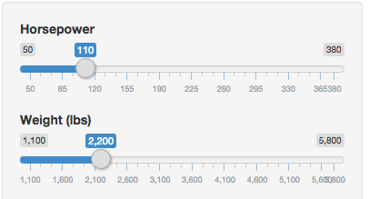
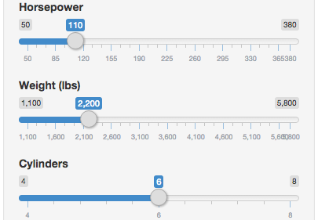
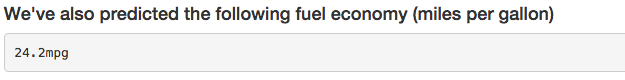

## Predicting Transmission

* Users are asked to input two variables which predict the transmission type (auto vs. manual)
    * Horsepower - a number from 50 to 380 in increments of 10
    * Weight (in lbs) - a number from 1100 to 5800 in increments of 100

#### User Input


#### Results


---

## Predicting Fuel Economy

Users are also given the opportunity to input the number of cylinders the engine has, either 4, 6 or 8. The application uses this, as well as horsepower and weight to predict the mpg.

#### User Input


#### Results


---

## How does it work?

The heart of the application is fitting a linear model with horsepower, weight, and number of cylinders from the `mtcars` dataset as well as a generalized linear model with horsepower and weight. These models are used to predict the mpg and transmission respectively.

For example, if a user inputs 110 horsepower, 2,200 lbs, and 6 cylinders we would predict the mpg and transmission.


```r
am.glm = glm(am ~ hp + wt, data=mtcars, family=binomial)
mpg.lm = lm(mpg ~ hp + wt + cyl, data=mtcars)
am.prediction = predict(am.glm, data.frame(hp=110, wt=2200/1000), type="response")
mpg.prediction = predict(mpg.lm, data.frame(hp=110, wt=2200/1000, cyl=6))
```

We then report the predicted likelihood that this is a manual transmission `99.38%` and the predicted fuel economy `24.2mpg`

--- &radio

## Quiz

Why are these predictions not necessarily usable in the real world?

1. We are using a tiny dataset.

2. We are ignoring many variables from the dataset which may impact our predictions.

3. There are other engineering factors outside of this dataset that also impact the variablse we are trying to predict.

4. _All of the above._

*** .hint

The dataset probably isn't big enough for what we are predicting.

*** .explanation

We are data scientists and likely don't know enough about vehicle engines to begin to understand the factors that actually determine what we are trying to predict, but that's why we're here, to predict. Also the dataset includes an incredibly tiny amount of observations.
